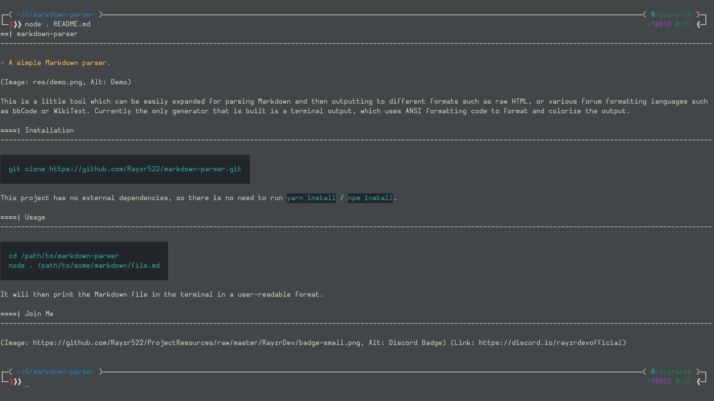

# markdown-parser

> A simple Markdown parser.



This is a little tool which can be easily expanded for parsing Markdown and then outputting to different formats such as raw HTML, or various forum formatting languages such as bbCode or WikiText. Currently the only generator that is built is a terminal output, which uses ANSI formatting code to format and colorize the output.

## Installation

```bash
git clone https://github.com/Rayzr522/markdown-parser.git
```

This project has no external dependencies, so there is no need to run `yarn install` / `npm install`.

## Usage

```bash
cd /path/to/markdown-parser
node . /path/to/some/markdown/file.md
```

It will then print the Markdown file in the terminal in a user-readable format.
